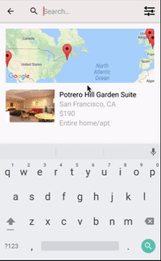
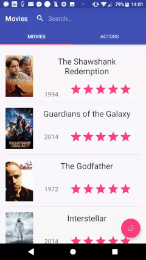

# InstantSearch Android: Examples
>Example apps built with algolia/instantsearch-android **v1**.

[**InstantSearch Android**](https://github.com/algolia/instantsearch-android) is a library providing widgets and helpers to help you build the best instant-search experience on Android with Algolia.
It is built on top of Algolia's [Android API Client](https://github.com/algolia/algoliasearch-client-android) to provide you a high-level solution to quickly build various search interfaces.

## Examples
We have built two demo applications to give you an idea of what you can build with InstantSearch Android:

## [Media application](https://github.com/algolia/instantsearch-android-examples/tree/master/media)

This example mimics the classical video search interface, with a modal to refine your search.

- Search in **video's title**
- Filter by *number of views*, *rating*, *video quality* or *captioning*
- Automatic focus on the SearchBox
- Automatic closing of the keyboard when scrolling through the videos
- Filtering in a `DialogFragment` applied only when the users submit their final filters

 
 
 
 
 
 
 

## [E-commerce application](https://github.com/algolia/instantsearch-android-examples/tree/master/ecommerce)

This example imitates a product search interface like well-known e-commerce applications.

- Search in the **product's name**, **seller's name**, and **category**
- Filter by *number of views*, *rating*, *video quality* or *captioning*
- Custom views using [`AlgoliaHitView`](https://github.com/algolia/instantsearch-android/blob/master/instantsearch/src/main/java/com/algolia/instantsearch/ui/views/AlgoliaHitView.java) for displaying the promotions, ratings, ...
- Filtering in a `PopupWindow` with immediate feedback to let the user see its influence on the search results

 
 
 
 
 
 
 

## [Tourism application](https://github.com/algolia/instantsearch-android-examples/tree/master/icebnb)

Example of a bed and breakfast search interface.

- Search a place by the **user's location** aka geo-search
- Filter with Numeric filters by **price**
- Custom [`MapWidget`](https://github.com/algolia/instantsearch-android-examples/blob/master/icebnb/src/main/java/com/algolia/instantsearch/examples/icebnb/widgets/MapWidget.java) for linking the search results with a `GoogleMap` and `MapFragment`

 
 
 
 
 
 
 
 
 
 
 

## [Movies application](https://github.com/algolia/instantsearch-android-examples/tree/master/movies)

Example of a movies search interface.

- Search movies and actors using either a movie's or an actor's name
- Multiple indices searched at the same time
- Offers two layout options: as tabs or as sections
