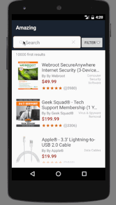

# InstantSearch Android: Examples
>Example apps built with algolia/instantsearch-android.

[**InstantSearch Android**](https://github.com/algolia/instantsearch-android) is a library providing widgets and helpers to help you build the best instant-search experience on Android with Algolia.
It is built on top of Algolia's [Android API Client](https://github.com/algolia/algoliasearch-client-android) to provide you a high-level solution to quickly build various search interfaces.

*InstantSearch Android is still in beta: some features or APIs may change before the final release.  
__Your feedback is very welcome!__ Don't hesitate to tell us what you think or report issues either [on the issue tracker](https://github.com/algolia/instantsearch-android/issues) or by [e-mailing us](mailto:pln+isa@algolia.com).*

## Examples
We have built two demo applications to give you an idea of what you can build with InstantSearch Android:

## [Media application](media-url)

This example mimics the classical video search interface, with a modal to refine your search.

- Search in **video's title**
- Filter by *number of views*, *rating*, *video quality* or *captioning* 
- Automatic focus on the SearchBox
- Automatic closing of the keyboard when scrolling through the videos
- Filtering in a `DialogFragment` applied only when the users submit their final filters

 
 
 
 
 
 
 
## [E-commerce application](ecommerce-url)

This example imitates a product search interface like well-known e-commerce applications.

- Search in the **product's name**, **seller's name**, and **category** 
- Filter by *number of views*, *rating*, *video quality* or *captioning* 
- Custom views using [`AlgoliaHitView`](https://github.com/algolia/instantsearch-android/blob/master/instantsearch/src/main/java/com/algolia/instantsearch/ui/views/AlgoliaHitView.java) for displaying the promotions, ratings, ...
- Filtering in a `PopupWindow` with immediate feedback to let the user see its influence on the search results

[media-url]: https://github.com/algolia/instantsearch-android-examples/tree/master/media
[ecommerce-url]: https://github.com/algolia/instantsearch-android-examples/tree/master/ecommerce
